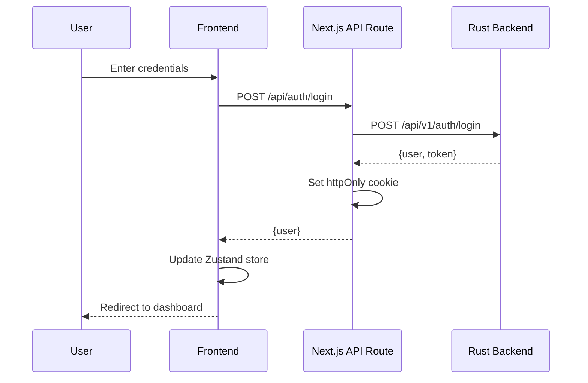
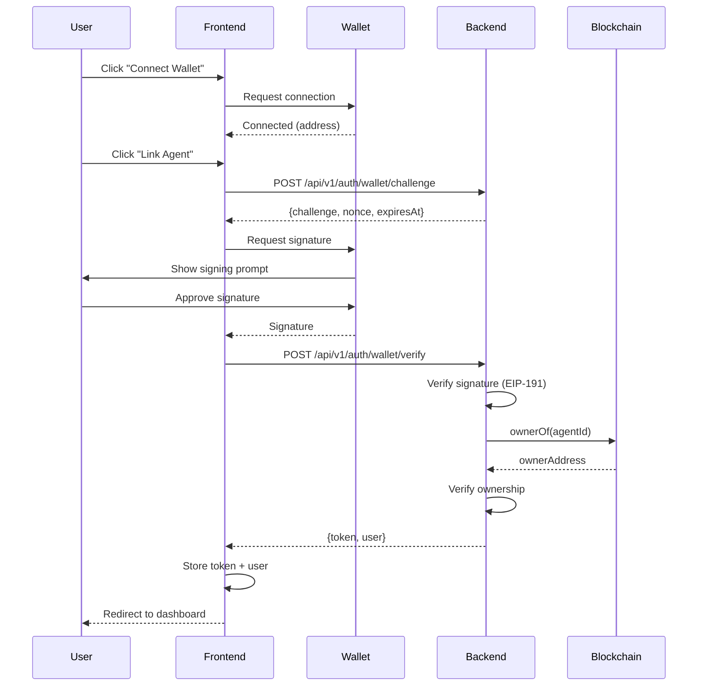

# Frontend Product Requirements Document

## api.8004.dev - ERC-8004 Reputation Dashboard

**Version**: 1.0.0
**Last Updated**: November 29, 2024
**Status**: Draft
**Author**: Development Team

---

## Table of Contents

1. [Executive Summary](#executive-summary)
2. [Technology Stack](#technology-stack)
3. [Architecture](#architecture)
4. [Feature Requirements](#feature-requirements)
5. [User Flows](#user-flows)
6. [UI/UX Specifications](#ui-ux-specifications)
7. [Security](#security)
8. [Performance](#performance)
9. [Implementation Timeline](#implementation-timeline)
10. [Testing Strategy](#testing-strategy)
11. [Deployment](#deployment)
12. [Appendices](#appendices)

---

## 1. Executive Summary

### 1.1 Project Overview

The api.8004.dev frontend is a comprehensive web application that provides developers and AI agents with a powerful interface to interact with the ERC-8004 reputation system. It enables users to:

- **Monitor** blockchain events from Identity, Reputation, and Validation registries
- **Create** programmable triggers that execute automated actions
- **Query** agent reputation data through a tiered API system
- **Manage** multi-tenant organizations with role-based access
- **Integrate** on-chain agents with off-chain systems via wallet signatures

### 1.2 Target Users

**Primary Personas**:

1. **Blockchain Developers**
   - Building AI agent applications on ERC-8004
   - Need real-time monitoring and automation
   - Want programmatic API access

2. **Agent Operators**
   - Running autonomous AI agents
   - Need reputation insights for self-improvement
   - Want automated feedback processing

3. **Organizations**
   - Managing multiple agents and team members
   - Need billing and usage tracking
   - Want centralized credential management

4. **Researchers & Analysts**
   - Studying agent reputation patterns
   - Need query tools and data exports
   - Want historical analytics

### 1.3 Key Objectives

1. **Simplify Complexity**: Transform complex blockchain data into intuitive visualizations
2. **Enable Automation**: Provide no-code trigger builder for non-technical users
3. **Ensure Security**: Implement 3-layer authentication with wallet integration
4. **Optimize Performance**: Sub-second page loads with real-time updates
5. **Scale Gracefully**: Support multi-tenant organizations with thousands of triggers

### 1.4 Success Metrics

**User Engagement**:
- **DAU/MAU Ratio**: >30% (daily active / monthly active users)
- **Session Duration**: >10 minutes average
- **Trigger Creation Rate**: >50% of users create at least 1 trigger

**Technical Performance**:
- **Lighthouse Score**: >90 (Performance, Accessibility, Best Practices, SEO)
- **Time to Interactive (TTI)**: <2 seconds on 4G
- **Core Web Vitals**: Pass all thresholds (LCP, FID, CLS)

**Business Metrics**:
- **Conversion Rate**: >10% free → paid upgrade
- **Credit Purchase Rate**: >30% of users purchase credits
- **Churn Rate**: <5% monthly

---

## 2. Technology Stack

### 2.1 Framework & Language

#### Next.js 14 (App Router)

**Rationale**:
- **React Server Components**: Reduce client-side JavaScript by 40-60%
- **Streaming SSR**: Improve perceived performance with progressive rendering
- **Built-in API Routes**: Simplify backend-for-frontend (BFF) pattern
- **Image Optimization**: Automatic WebP/AVIF conversion and lazy loading
- **TypeScript Integration**: First-class TypeScript support out of the box

**Alternatives Considered**:
- ❌ **Remix**: Less mature ecosystem, smaller community
- ❌ **SvelteKit**: TypeScript support not as robust
- ❌ **Astro**: Better for content sites, not complex dashboards

#### TypeScript 5.3+

**Rationale**:
- **Type Safety**: Catch 80% of runtime errors at compile time
- **IntelliSense**: Superior developer experience with autocomplete
- **Refactoring**: Safe large-scale code changes
- **Documentation**: Types serve as inline documentation

**Configuration**:
```json
{
  "compilerOptions": {
    "strict": true,
    "strictNullChecks": true,
    "noUncheckedIndexedAccess": true,
    "noImplicitAny": true,
    "target": "ES2022",
    "lib": ["ES2022", "DOM", "DOM.Iterable"],
    "module": "ESNext",
    "moduleResolution": "bundler",
    "jsx": "preserve",
    "paths": {
      "@/*": ["./src/*"],
      "@/components/*": ["./src/components/*"],
      "@/lib/*": ["./src/lib/*"]
    }
  }
}
```

### 2.2 Styling & UI

#### TailwindCSS 3.4+

**Rationale**:
- **Utility-First**: No CSS naming conflicts, faster development
- **Tree-Shaking**: Unused styles automatically removed (10KB typical bundle)
- **Design Tokens**: Consistent spacing, colors, typography
- **Dark Mode**: Built-in dark mode support with `class` strategy
- **Responsive**: Mobile-first breakpoint system

**Configuration**:
```javascript
// tailwind.config.ts
export default {
  darkMode: ['class'],
  content: ['./src/**/*.{ts,tsx}'],
  theme: {
    extend: {
      colors: {
        border: 'hsl(var(--border))',
        background: 'hsl(var(--background))',
        foreground: 'hsl(var(--foreground))',
        primary: {
          DEFAULT: 'hsl(var(--primary))',
          foreground: 'hsl(var(--primary-foreground))',
        },
        // ... shadcn/ui theme variables
      },
      borderRadius: {
        lg: 'var(--radius)',
        md: 'calc(var(--radius) - 2px)',
        sm: 'calc(var(--radius) - 4px)',
      },
    },
  },
  plugins: [require('tailwindcss-animate')],
}
```

#### Shadcn/ui Component Library

**Rationale**:
- **Copy-Paste Components**: Full control over code, no black boxes
- **Radix UI Primitives**: Accessible, unstyled components (WAI-ARIA compliant)
- **Customizable**: Easy theming with CSS variables
- **Lightweight**: Only include components you use (no bundle bloat)
- **TypeScript**: Fully typed components

**Core Components**:
- `Button`, `Input`, `Select`, `Checkbox`, `Radio`, `Switch`
- `Dialog`, `Sheet`, `Popover`, `Tooltip`, `DropdownMenu`
- `Table`, `Card`, `Badge`, `Avatar`, `Separator`
- `Form` (with React Hook Form integration)
- `Command` (Cmd+K search interface)
- `Tabs`, `Accordion`, `Collapsible`

**Alternatives Considered**:
- ❌ **Material UI**: Too opinionated, large bundle size (200KB+)
- ❌ **Chakra UI**: Good but less control over styling
- ❌ **Ant Design**: Not suitable for modern design aesthetics

### 2.3 State Management

#### Zustand (Client State)

**Rationale**:
- **Minimal Boilerplate**: 10x less code than Redux
- **TypeScript-First**: Excellent type inference
- **Devtools**: Redux DevTools integration
- **Middleware**: Persist, immer, combine stores
- **React Concurrent**: Full support for React 18 features

**Example Store**:
```typescript
// src/stores/auth-store.ts
import { create } from 'zustand'
import { persist } from 'zustand/middleware'

interface AuthState {
  user: User | null
  token: string | null
  isAuthenticated: boolean
  login: (credentials: LoginCredentials) => Promise<void>
  logout: () => void
  refreshToken: () => Promise<void>
}

export const useAuthStore = create<AuthState>()(
  persist(
    (set, get) => ({
      user: null,
      token: null,
      isAuthenticated: false,

      login: async (credentials) => {
        const response = await fetch('/api/v1/auth/login', {
          method: 'POST',
          body: JSON.stringify(credentials),
        })
        const { user, token } = await response.json()
        set({ user, token, isAuthenticated: true })
      },

      logout: () => {
        set({ user: null, token: null, isAuthenticated: false })
      },

      refreshToken: async () => {
        // Implementation
      },
    }),
    {
      name: 'auth-storage',
      partialize: (state) => ({ token: state.token }), // Only persist token
    }
  )
)
```

#### TanStack Query v5 (Server State)

**Rationale**:
- **Automatic Caching**: Smart cache invalidation with stale-while-revalidate
- **Background Refetching**: Keep data fresh without user interaction
- **Optimistic Updates**: Instant UI feedback before server confirmation
- **Request Deduplication**: Prevent duplicate API calls
- **Infinite Queries**: Perfect for paginated lists

**Example Query**:
```typescript
// src/hooks/use-triggers.ts
import { useQuery, useMutation, useQueryClient } from '@tanstack/react-query'

export function useTriggers(organizationId: string) {
  return useQuery({
    queryKey: ['triggers', organizationId],
    queryFn: () => fetchTriggers(organizationId),
    staleTime: 30_000, // 30 seconds
    gcTime: 5 * 60_000, // 5 minutes
  })
}

export function useCreateTrigger() {
  const queryClient = useQueryClient()

  return useMutation({
    mutationFn: createTrigger,
    onMutate: async (newTrigger) => {
      // Cancel outgoing refetches
      await queryClient.cancelQueries({ queryKey: ['triggers'] })

      // Snapshot previous value
      const previousTriggers = queryClient.getQueryData(['triggers'])

      // Optimistically update
      queryClient.setQueryData(['triggers'], (old) => [...old, newTrigger])

      return { previousTriggers }
    },
    onError: (err, newTrigger, context) => {
      // Rollback on error
      queryClient.setQueryData(['triggers'], context.previousTriggers)
    },
    onSettled: () => {
      // Refetch after mutation
      queryClient.invalidateQueries({ queryKey: ['triggers'] })
    },
  })
}
```

**Alternatives Considered**:
- ❌ **Redux Toolkit**: Too heavy for this use case
- ❌ **SWR**: Less features than TanStack Query (no mutations API)
- ❌ **Apollo Client**: GraphQL-specific, we use REST

### 2.4 Forms & Validation

#### React Hook Form

**Rationale**:
- **Performance**: Uncontrolled inputs, minimal re-renders
- **TypeScript**: Full type inference for form values
- **Validation**: Seamless Zod integration
- **DevTools**: Browser extension for debugging
- **Accessibility**: Built-in ARIA attributes

#### Zod Validation

**Rationale**:
- **Type Safety**: Infer TypeScript types from schemas
- **Runtime Validation**: Catch errors before API calls
- **Custom Validators**: Easy to add business logic
- **Error Messages**: Customizable, i18n-ready
- **Composability**: Reuse schemas across forms

**Example Form**:
```typescript
// src/schemas/trigger-schema.ts
import { z } from 'zod'

export const triggerSchema = z.object({
  name: z.string().min(1, 'Name is required').max(255),
  description: z.string().max(1000).optional(),
  organizationId: z.string().uuid(),
  chainId: z.number().int().positive(),
  registry: z.enum(['identity', 'reputation', 'validation']),
  enabled: z.boolean().default(true),
  isStateful: z.boolean().default(false),
  conditions: z.array(
    z.object({
      conditionType: z.string(),
      field: z.string(),
      operator: z.string(),
      value: z.string(),
      config: z.record(z.any()).optional(),
    })
  ).min(1, 'At least one condition required'),
  actions: z.array(
    z.object({
      actionType: z.enum(['telegram', 'rest', 'mcp']),
      priority: z.number().int().min(0).default(0),
      config: z.record(z.any()),
    })
  ).min(1, 'At least one action required'),
})

export type TriggerFormValues = z.infer<typeof triggerSchema>

// src/components/trigger-form.tsx
import { useForm } from 'react-hook-form'
import { zodResolver } from '@hookform/resolvers/zod'

function TriggerForm() {
  const form = useForm<TriggerFormValues>({
    resolver: zodResolver(triggerSchema),
    defaultValues: {
      enabled: true,
      isStateful: false,
      conditions: [],
      actions: [],
    },
  })

  const onSubmit = async (data: TriggerFormValues) => {
    await createTrigger(data)
  }

  return (
    <Form {...form}>
      <form onSubmit={form.handleSubmit(onSubmit)}>
        {/* Form fields */}
      </form>
    </Form>
  )
}
```

### 2.5 Charts & Visualizations

#### Recharts

**Rationale**:
- **React-Native**: Built with React components (no D3.js wrapper)
- **Responsive**: Automatic chart resizing
- **Composable**: Mix and match chart types
- **Animations**: Smooth transitions out of the box
- **Tooltips**: Rich interactive tooltips

**Chart Types Used**:
- **Line Chart**: Reputation trends over time
- **Bar Chart**: Event counts by registry
- **Pie Chart**: Credit usage by tier
- **Area Chart**: Query volume with stacked areas
- **Scatter Plot**: Score distribution analysis

**Example Chart**:
```typescript
// src/components/reputation-trend-chart.tsx
import { LineChart, Line, XAxis, YAxis, Tooltip, ResponsiveContainer } from 'recharts'

interface DataPoint {
  timestamp: number
  averageScore: number
}

function ReputationTrendChart({ data }: { data: DataPoint[] }) {
  return (
    <ResponsiveContainer width="100%" height={350}>
      <LineChart data={data}>
        <XAxis
          dataKey="timestamp"
          tickFormatter={(unix) => new Date(unix * 1000).toLocaleDateString()}
        />
        <YAxis domain={[0, 100]} />
        <Tooltip
          labelFormatter={(unix) => new Date(unix * 1000).toLocaleString()}
          formatter={(value) => [`${value}/100`, 'Average Score']}
        />
        <Line
          type="monotone"
          dataKey="averageScore"
          stroke="hsl(var(--primary))"
          strokeWidth={2}
          dot={{ r: 3 }}
          activeDot={{ r: 5 }}
        />
      </LineChart>
    </ResponsiveContainer>
  )
}
```

**Alternatives Considered**:
- ❌ **Chart.js**: Imperative API, not React-friendly
- ❌ **Victory**: Larger bundle size, slower performance
- ❌ **Nivo**: Good but less customizable

### 2.6 Web3 Integration

#### Wagmi + Viem

**Rationale**:
- **TypeScript**: Full type safety for Ethereum interactions
- **React Hooks**: useAccount, useConnect, useSignMessage
- **Multi-Chain**: Support for all ERC-8004 chains (Ethereum, Base, Linea, Polygon)
- **Wallet Support**: MetaMask, WalletConnect, Coinbase Wallet, Rainbow
- **Modern**: Built on viem (successor to ethers.js)

**Configuration**:
```typescript
// src/lib/wagmi-config.ts
import { createConfig, http } from 'wagmi'
import { mainnet, base, sepolia, baseSepolia, lineaSepolia, polygonAmoy } from 'wagmi/chains'
import { injected, walletConnect, coinbaseWallet } from 'wagmi/connectors'

export const wagmiConfig = createConfig({
  chains: [mainnet, base, sepolia, baseSepolia, lineaSepolia, polygonAmoy],
  connectors: [
    injected(),
    walletConnect({ projectId: process.env.NEXT_PUBLIC_WALLETCONNECT_PROJECT_ID! }),
    coinbaseWallet({ appName: 'api.8004.dev' }),
  ],
  transports: {
    [mainnet.id]: http(process.env.NEXT_PUBLIC_ETHEREUM_RPC_URL),
    [base.id]: http(process.env.NEXT_PUBLIC_BASE_RPC_URL),
    [sepolia.id]: http(process.env.NEXT_PUBLIC_SEPOLIA_RPC_URL),
    [baseSepolia.id]: http(process.env.NEXT_PUBLIC_BASE_SEPOLIA_RPC_URL),
    [lineaSepolia.id]: http(process.env.NEXT_PUBLIC_LINEA_SEPOLIA_RPC_URL),
    [polygonAmoy.id]: http(process.env.NEXT_PUBLIC_POLYGON_AMOY_RPC_URL),
  },
})
```

**Example Usage**:
```typescript
// src/components/wallet-connect-button.tsx
import { useAccount, useConnect, useDisconnect } from 'wagmi'

function WalletConnectButton() {
  const { address, isConnected } = useAccount()
  const { connect, connectors } = useConnect()
  const { disconnect } = useDisconnect()

  if (isConnected) {
    return (
      <Button onClick={() => disconnect()}>
        {address?.slice(0, 6)}...{address?.slice(-4)}
      </Button>
    )
  }

  return (
    <DropdownMenu>
      <DropdownMenuTrigger asChild>
        <Button>Connect Wallet</Button>
      </DropdownMenuTrigger>
      <DropdownMenuContent>
        {connectors.map((connector) => (
          <DropdownMenuItem
            key={connector.id}
            onClick={() => connect({ connector })}
          >
            {connector.name}
          </DropdownMenuItem>
        ))}
      </DropdownMenuContent>
    </DropdownMenu>
  )
}
```

### 2.7 API Client

#### Custom Fetch Wrapper

**Rationale**:
- **Centralized**: Single source of truth for API configuration
- **Interceptors**: Request/response middleware for auth, logging
- **Retry Logic**: Exponential backoff for transient failures
- **Type Safety**: Full TypeScript types for all endpoints
- **Error Handling**: Standardized error responses

**Implementation**:
```typescript
// src/lib/api-client.ts
import { useAuthStore } from '@/stores/auth-store'

interface ApiOptions extends RequestInit {
  params?: Record<string, string>
  retry?: number
  timeout?: number
}

class ApiClient {
  private baseURL: string

  constructor(baseURL: string) {
    this.baseURL = baseURL
  }

  async request<T>(endpoint: string, options: ApiOptions = {}): Promise<T> {
    const { params, retry = 3, timeout = 30000, ...fetchOptions } = options

    // Build URL with query params
    const url = new URL(endpoint, this.baseURL)
    if (params) {
      Object.entries(params).forEach(([key, value]) => {
        url.searchParams.set(key, value)
      })
    }

    // Add authentication header
    const token = useAuthStore.getState().token
    const headers = new Headers(fetchOptions.headers)
    if (token) {
      headers.set('Authorization', `Bearer ${token}`)
    }
    headers.set('Content-Type', 'application/json')

    // Retry logic with exponential backoff
    let lastError: Error
    for (let attempt = 0; attempt < retry; attempt++) {
      try {
        const controller = new AbortController()
        const timeoutId = setTimeout(() => controller.abort(), timeout)

        const response = await fetch(url.toString(), {
          ...fetchOptions,
          headers,
          signal: controller.signal,
        })

        clearTimeout(timeoutId)

        if (!response.ok) {
          const error = await response.json()
          throw new ApiError(response.status, error.message, error)
        }

        return await response.json()
      } catch (error) {
        lastError = error as Error

        // Don't retry on client errors (4xx)
        if (error instanceof ApiError && error.status >= 400 && error.status < 500) {
          throw error
        }

        // Exponential backoff: 1s, 2s, 4s
        if (attempt < retry - 1) {
          await new Promise(resolve => setTimeout(resolve, Math.pow(2, attempt) * 1000))
        }
      }
    }

    throw lastError!
  }

  get<T>(endpoint: string, options?: ApiOptions) {
    return this.request<T>(endpoint, { ...options, method: 'GET' })
  }

  post<T>(endpoint: string, data?: unknown, options?: ApiOptions) {
    return this.request<T>(endpoint, {
      ...options,
      method: 'POST',
      body: JSON.stringify(data),
    })
  }

  put<T>(endpoint: string, data?: unknown, options?: ApiOptions) {
    return this.request<T>(endpoint, {
      ...options,
      method: 'PUT',
      body: JSON.stringify(data),
    })
  }

  delete<T>(endpoint: string, options?: ApiOptions) {
    return this.request<T>(endpoint, { ...options, method: 'DELETE' })
  }
}

export class ApiError extends Error {
  constructor(
    public status: number,
    message: string,
    public data?: unknown
  ) {
    super(message)
    this.name = 'ApiError'
  }
}

export const apiClient = new ApiClient(
  process.env.NEXT_PUBLIC_API_BASE_URL || 'http://localhost:8080'
)
```

**Typed API Endpoints**:
```typescript
// src/lib/api/triggers.ts
import { apiClient } from '../api-client'

export interface Trigger {
  id: string
  userId: string
  organizationId: string
  name: string
  description?: string
  chainId: number
  registry: 'identity' | 'reputation' | 'validation'
  enabled: boolean
  isStateful: boolean
  createdAt: string
  updatedAt: string
  conditions?: Condition[]
  actions?: Action[]
}

export interface PaginatedResponse<T> {
  data: T[]
  pagination: {
    total: number
    limit: number
    offset: number
    hasMore: boolean
  }
}

export const triggersApi = {
  list: (organizationId: string, params?: { limit?: number; offset?: number }) =>
    apiClient.get<PaginatedResponse<Trigger>>('/api/v1/triggers', { params }),

  get: (id: string) =>
    apiClient.get<{ data: Trigger }>(`/api/v1/triggers/${id}`),

  create: (data: Omit<Trigger, 'id' | 'createdAt' | 'updatedAt'>) =>
    apiClient.post<{ data: Trigger }>('/api/v1/triggers', data),

  update: (id: string, data: Partial<Trigger>) =>
    apiClient.put<{ data: Trigger }>(`/api/v1/triggers/${id}`, data),

  delete: (id: string) =>
    apiClient.delete(`/api/v1/triggers/${id}`),
}
```

### 2.8 Development Tools

#### ESLint + Prettier

**Configuration**:
```javascript
// .eslintrc.js
module.exports = {
  extends: [
    'next/core-web-vitals',
    'plugin:@typescript-eslint/recommended',
    'prettier',
  ],
  plugins: ['@typescript-eslint'],
  rules: {
    '@typescript-eslint/no-unused-vars': ['error', { argsIgnorePattern: '^_' }],
    '@typescript-eslint/no-explicit-any': 'warn',
    '@typescript-eslint/explicit-function-return-type': 'off',
  },
}

// .prettierrc
{
  "semi": false,
  "singleQuote": true,
  "trailingComma": "es5",
  "printWidth": 100,
  "tabWidth": 2,
  "plugins": ["prettier-plugin-tailwindcss"]
}
```

#### Husky + lint-staged

**Pre-commit Hooks**:
```json
// package.json
{
  "lint-staged": {
    "*.{ts,tsx}": [
      "eslint --fix",
      "prettier --write"
    ],
    "*.{json,md}": [
      "prettier --write"
    ]
  }
}
```

### 2.9 Stack Summary

| Category | Technology | Version | Justification |
|----------|-----------|---------|---------------|
| **Framework** | Next.js | 14.x | App Router, RSC, Image Optimization |
| **Language** | TypeScript | 5.3+ | Type Safety, DX |
| **Styling** | TailwindCSS | 3.4+ | Utility-First, Tree-Shaking |
| **Components** | Shadcn/ui | Latest | Customizable, Accessible |
| **Client State** | Zustand | 4.x | Minimal, TypeScript-First |
| **Server State** | TanStack Query | 5.x | Caching, Optimistic Updates |
| **Forms** | React Hook Form | 7.x | Performance, TypeScript |
| **Validation** | Zod | 3.x | Runtime + Compile-time |
| **Charts** | Recharts | 2.x | React-Native, Composable |
| **Web3** | Wagmi + Viem | 2.x | Modern, Type-Safe |
| **Testing** | Vitest + Playwright | Latest | Fast, Full Coverage |
| **Linting** | ESLint + Prettier | Latest | Code Quality |

---

## 3. Architecture

### 3.1 Project Structure

```
api.8004.dev-frontend/
├── .github/
│   └── workflows/
│       ├── ci.yml                    # CI/CD pipeline
│       ├── preview.yml               # PR preview deployments
│       └── release.yml               # Production deployments
├── public/
│   ├── images/
│   ├── icons/
│   └── manifest.json                 # PWA manifest
├── src/
│   ├── app/                          # Next.js App Router
│   │   ├── (auth)/                   # Auth group (separate layout)
│   │   │   ├── login/
│   │   │   │   └── page.tsx
│   │   │   ├── register/
│   │   │   │   └── page.tsx
│   │   │   └── layout.tsx
│   │   ├── (dashboard)/              # Dashboard group (authenticated)
│   │   │   ├── dashboard/
│   │   │   │   └── page.tsx
│   │   │   ├── organizations/
│   │   │   │   ├── page.tsx
│   │   │   │   ├── [id]/
│   │   │   │   │   ├── page.tsx
│   │   │   │   │   ├── members/
│   │   │   │   │   │   └── page.tsx
│   │   │   │   │   └── settings/
│   │   │   │   │       └── page.tsx
│   │   │   │   └── new/
│   │   │   │       └── page.tsx
│   │   │   ├── triggers/
│   │   │   │   ├── page.tsx
│   │   │   │   ├── [id]/
│   │   │   │   │   ├── page.tsx
│   │   │   │   │   └── edit/
│   │   │   │   │       └── page.tsx
│   │   │   │   └── new/
│   │   │   │       └── page.tsx
│   │   │   ├── api-keys/
│   │   │   │   └── page.tsx
│   │   │   ├── agents/
│   │   │   │   └── page.tsx
│   │   │   ├── billing/
│   │   │   │   ├── page.tsx
│   │   │   │   └── purchase/
│   │   │   │       └── page.tsx
│   │   │   ├── queries/
│   │   │   │   ├── page.tsx
│   │   │   │   └── [tier]/
│   │   │   │       └── page.tsx
│   │   │   ├── events/
│   │   │   │   └── page.tsx
│   │   │   ├── settings/
│   │   │   │   └── page.tsx
│   │   │   └── layout.tsx
│   │   ├── api/                      # API Routes (BFF pattern)
│   │   │   ├── auth/
│   │   │   │   └── [...nextauth]/
│   │   │   │       └── route.ts
│   │   │   ├── webhooks/
│   │   │   │   └── stripe/
│   │   │   │       └── route.ts
│   │   │   └── proxy/                # API proxy with auth
│   │   │       └── [...path]/
│   │   │           └── route.ts
│   │   ├── layout.tsx                # Root layout
│   │   ├── providers.tsx             # Context providers
│   │   └── globals.css               # Global styles
│   ├── components/
│   │   ├── ui/                       # Shadcn/ui components
│   │   │   ├── button.tsx
│   │   │   ├── input.tsx
│   │   │   ├── dialog.tsx
│   │   │   └── ...
│   │   ├── layout/
│   │   │   ├── header.tsx
│   │   │   ├── sidebar.tsx
│   │   │   ├── footer.tsx
│   │   │   └── breadcrumbs.tsx
│   │   ├── auth/
│   │   │   ├── login-form.tsx
│   │   │   ├── register-form.tsx
│   │   │   └── wallet-connect-button.tsx
│   │   ├── triggers/
│   │   │   ├── trigger-list.tsx
│   │   │   ├── trigger-card.tsx
│   │   │   ├── trigger-form.tsx
│   │   │   ├── condition-builder.tsx
│   │   │   └── action-builder.tsx
│   │   ├── organizations/
│   │   │   ├── organization-switcher.tsx
│   │   │   ├── member-list.tsx
│   │   │   └── invite-member-dialog.tsx
│   │   ├── billing/
│   │   │   ├── credit-balance-widget.tsx
│   │   │   ├── purchase-credits-form.tsx
│   │   │   └── transaction-history.tsx
│   │   ├── charts/
│   │   │   ├── reputation-trend-chart.tsx
│   │   │   ├── event-volume-chart.tsx
│   │   │   └── usage-breakdown-chart.tsx
│   │   └── shared/
│   │       ├── loading-spinner.tsx
│   │       ├── error-boundary.tsx
│   │       ├── empty-state.tsx
│   │       └── data-table.tsx
│   ├── lib/
│   │   ├── api/
│   │   │   ├── triggers.ts           # Trigger API client
│   │   │   ├── organizations.ts      # Organization API client
│   │   │   ├── api-keys.ts           # API Keys client
│   │   │   ├── billing.ts            # Billing client
│   │   │   └── queries.ts            # Query tools client
│   │   ├── api-client.ts             # Base API client
│   │   ├── wagmi-config.ts           # Wagmi configuration
│   │   ├── query-client.ts           # TanStack Query config
│   │   ├── utils.ts                  # Utility functions
│   │   └── constants.ts              # App constants
│   ├── hooks/
│   │   ├── use-triggers.ts
│   │   ├── use-organizations.ts
│   │   ├── use-api-keys.ts
│   │   ├── use-billing.ts
│   │   ├── use-events.ts
│   │   ├── use-wallet-signature.ts
│   │   └── use-debounce.ts
│   ├── stores/
│   │   ├── auth-store.ts             # Auth state
│   │   ├── organization-store.ts     # Current org state
│   │   └── ui-store.ts               # UI preferences
│   ├── schemas/
│   │   ├── trigger-schema.ts         # Trigger validation
│   │   ├── organization-schema.ts    # Organization validation
│   │   ├── api-key-schema.ts         # API Key validation
│   │   └── billing-schema.ts         # Billing validation
│   ├── types/
│   │   ├── api.ts                    # API response types
│   │   ├── models.ts                 # Domain models
│   │   └── index.ts
│   └── middleware.ts                 # Next.js middleware
├── tests/
│   ├── unit/
│   ├── integration/
│   └── e2e/
├── .env.example
├── .env.local
├── next.config.js
├── tsconfig.json
├── tailwind.config.ts
├── package.json
└── README.md
```

### 3.2 App Router Strategy

#### Route Groups

**Authentication Routes** (`(auth)` group):
- Separate layout without dashboard shell
- No authentication required
- Redirects authenticated users to dashboard

**Dashboard Routes** (`(dashboard)` group):
- Shared layout with sidebar + header
- Authentication required (middleware)
- Organization context loaded

#### Server vs Client Components

**Server Components** (default):
- Fetch data directly in components
- No JavaScript sent to client
- SEO-friendly

```typescript
// app/(dashboard)/triggers/page.tsx (Server Component)
import { TriggersTable } from '@/components/triggers/triggers-table'
import { apiClient } from '@/lib/api-client'

export default async function TriggersPage() {
  // Fetch data on server
  const triggers = await apiClient.get<Trigger[]>('/api/v1/triggers')

  return (
    <div>
      <h1>Triggers</h1>
      <TriggersTable data={triggers} />
    </div>
  )
}
```

**Client Components** (interactive):
- Use `'use client'` directive
- Event handlers, hooks, state
- Minimal for performance

```typescript
// components/triggers/triggers-table.tsx (Client Component)
'use client'

import { useState } from 'react'
import { DataTable } from '@/components/ui/data-table'

export function TriggersTable({ data }: { data: Trigger[] }) {
  const [selectedTrigger, setSelectedTrigger] = useState<Trigger | null>(null)

  return (
    <DataTable
      data={data}
      onRowClick={setSelectedTrigger}
    />
  )
}
```

#### Streaming with Suspense

```typescript
// app/(dashboard)/dashboard/page.tsx
import { Suspense } from 'react'
import { Skeleton } from '@/components/ui/skeleton'
import { RecentEvents } from '@/components/dashboard/recent-events'
import { ActiveTriggers } from '@/components/dashboard/active-triggers'

export default function DashboardPage() {
  return (
    <div className="grid gap-4 md:grid-cols-2">
      <Suspense fallback={<Skeleton className="h-[400px]" />}>
        <RecentEvents />
      </Suspense>

      <Suspense fallback={<Skeleton className="h-[400px]" />}>
        <ActiveTriggers />
      </Suspense>
    </div>
  )
}
```

### 3.3 Authentication Flow

#### JWT Token Management

**Storage Strategy**:
- **Access Token**: httpOnly cookie (most secure)
- **Refresh Token**: httpOnly cookie (secure)
- **User Info**: Zustand store (client state)

**Flow**:


**Middleware**:
```typescript
// src/middleware.ts
import { NextResponse } from 'next/server'
import type { NextRequest } from 'next/server'

export function middleware(request: NextRequest) {
  const token = request.cookies.get('auth-token')
  const isAuthPage = request.nextUrl.pathname.startsWith('/login') ||
                     request.nextUrl.pathname.startsWith('/register')
  const isDashboardPage = request.nextUrl.pathname.startsWith('/dashboard')

  // Redirect authenticated users away from auth pages
  if (token && isAuthPage) {
    return NextResponse.redirect(new URL('/dashboard', request.url))
  }

  // Redirect unauthenticated users to login
  if (!token && isDashboardPage) {
    return NextResponse.redirect(new URL('/login', request.url))
  }

  return NextResponse.next()
}

export const config = {
  matcher: ['/((?!api|_next/static|_next/image|favicon.ico).*)'],
}
```

#### Wallet Signature Flow



**Implementation**:
```typescript
// src/hooks/use-wallet-signature.ts
import { useSignMessage } from 'wagmi'
import { apiClient } from '@/lib/api-client'

export function useWalletSignature() {
  const { signMessageAsync } = useSignMessage()

  const linkAgent = async (agentId: number, chainId: number, organizationId: string) => {
    // Step 1: Get challenge from backend
    const { challenge, nonce, expiresAt } = await apiClient.post<ChallengeResponse>(
      '/api/v1/auth/wallet/challenge',
      { agentId, chainId }
    )

    // Step 2: Sign challenge with wallet
    const signature = await signMessageAsync({ message: challenge })

    // Step 3: Verify signature and link agent
    const result = await apiClient.post('/api/v1/agents/link', {
      agentId,
      chainId,
      organizationId,
      challenge,
      signature,
    })

    return result
  }

  return { linkAgent }
}
```

### 3.4 State Management Patterns

#### Zustand Store Structure

```typescript
// src/stores/organization-store.ts
import { create } from 'zustand'
import { devtools } from 'zustand/middleware'

interface OrganizationState {
  currentOrganization: Organization | null
  organizations: Organization[]
  isLoading: boolean
  error: string | null

  setCurrentOrganization: (org: Organization) => void
  loadOrganizations: () => Promise<void>
  createOrganization: (data: CreateOrganizationInput) => Promise<Organization>
  updateOrganization: (id: string, data: UpdateOrganizationInput) => Promise<void>
}

export const useOrganizationStore = create<OrganizationState>()(
  devtools(
    (set, get) => ({
      currentOrganization: null,
      organizations: [],
      isLoading: false,
      error: null,

      setCurrentOrganization: (org) => set({ currentOrganization: org }),

      loadOrganizations: async () => {
        set({ isLoading: true, error: null })
        try {
          const organizations = await organizationsApi.list()
          set({ organizations, isLoading: false })
        } catch (error) {
          set({ error: (error as Error).message, isLoading: false })
        }
      },

      createOrganization: async (data) => {
        const organization = await organizationsApi.create(data)
        set((state) => ({
          organizations: [...state.organizations, organization],
          currentOrganization: organization,
        }))
        return organization
      },

      updateOrganization: async (id, data) => {
        const updated = await organizationsApi.update(id, data)
        set((state) => ({
          organizations: state.organizations.map((org) =>
            org.id === id ? updated : org
          ),
          currentOrganization:
            state.currentOrganization?.id === id
              ? updated
              : state.currentOrganization,
        }))
      },
    }),
    { name: 'OrganizationStore' }
  )
)
```

#### TanStack Query Patterns

**Infinite Queries** (pagination):
```typescript
// src/hooks/use-triggers-infinite.ts
import { useInfiniteQuery } from '@tanstack/react-query'

export function useTriggersInfinite(organizationId: string) {
  return useInfiniteQuery({
    queryKey: ['triggers', 'infinite', organizationId],
    queryFn: ({ pageParam = 0 }) =>
      triggersApi.list(organizationId, { limit: 20, offset: pageParam }),
    initialPageParam: 0,
    getNextPageParam: (lastPage) =>
      lastPage.pagination.hasMore
        ? lastPage.pagination.offset + lastPage.pagination.limit
        : undefined,
  })
}

// Usage in component
function TriggersList() {
  const { data, fetchNextPage, hasNextPage, isFetchingNextPage } = useTriggersInfinite(orgId)

  return (
    <div>
      {data?.pages.map((page) =>
        page.data.map((trigger) => <TriggerCard key={trigger.id} trigger={trigger} />)
      )}

      {hasNextPage && (
        <Button onClick={() => fetchNextPage()} disabled={isFetchingNextPage}>
          {isFetchingNextPage ? 'Loading...' : 'Load More'}
        </Button>
      )}
    </div>
  )
}
```

**Optimistic Updates**:
```typescript
// src/hooks/use-toggle-trigger.ts
import { useMutation, useQueryClient } from '@tanstack/react-query'

export function useToggleTrigger() {
  const queryClient = useQueryClient()

  return useMutation({
    mutationFn: async ({ id, enabled }: { id: string; enabled: boolean }) =>
      triggersApi.update(id, { enabled }),

    onMutate: async ({ id, enabled }) => {
      // Cancel outgoing refetches
      await queryClient.cancelQueries({ queryKey: ['triggers'] })

      // Snapshot previous value
      const previous = queryClient.getQueryData<Trigger[]>(['triggers'])

      // Optimistically update
      queryClient.setQueryData<Trigger[]>(['triggers'], (old) =>
        old?.map((t) => (t.id === id ? { ...t, enabled } : t))
      )

      return { previous }
    },

    onError: (err, variables, context) => {
      // Rollback on error
      queryClient.setQueryData(['triggers'], context?.previous)
      toast.error('Failed to update trigger')
    },

    onSuccess: () => {
      toast.success('Trigger updated successfully')
    },

    onSettled: () => {
      queryClient.invalidateQueries({ queryKey: ['triggers'] })
    },
  })
}
```

### 3.5 Real-Time Updates

#### Server-Sent Events (SSE)

**Event Stream Hook**:
```typescript
// src/hooks/use-event-stream.ts
import { useEffect, useState } from 'react'
import { useQueryClient } from '@tanstack/react-query'

export function useEventStream(organizationId: string) {
  const [isConnected, setIsConnected] = useState(false)
  const queryClient = useQueryClient()

  useEffect(() => {
    const eventSource = new EventSource(
      `/api/events/stream?organizationId=${organizationId}`
    )

    eventSource.onopen = () => {
      setIsConnected(true)
      console.log('SSE connected')
    }

    eventSource.onmessage = (event) => {
      const data = JSON.parse(event.data)

      // Update TanStack Query cache
      queryClient.setQueryData<Event[]>(['events'], (old) => [data, ...(old || [])])

      // Show toast notification
      toast.info(`New ${data.registry} event from chain ${data.chainId}`)
    }

    eventSource.onerror = () => {
      setIsConnected(false)
      console.error('SSE error')
      eventSource.close()
    }

    return () => {
      eventSource.close()
    }
  }, [organizationId, queryClient])

  return { isConnected }
}
```

**Polling Fallback**:
```typescript
// src/hooks/use-events-polling.ts
import { useQuery } from '@tanstack/react-query'

export function useEventsPolling(organizationId: string, enabled = true) {
  return useQuery({
    queryKey: ['events', organizationId],
    queryFn: () => eventsApi.list(organizationId, { limit: 50 }),
    refetchInterval: enabled ? 5000 : false, // Poll every 5 seconds
    refetchIntervalInBackground: false,
  })
}
```

### 3.6 Error Handling

#### Global Error Boundary

```typescript
// src/components/shared/error-boundary.tsx
'use client'

import { Component, ReactNode } from 'react'
import { Button } from '@/components/ui/button'
import { AlertCircle } from 'lucide-react'

interface Props {
  children: ReactNode
}

interface State {
  hasError: boolean
  error?: Error
}

export class ErrorBoundary extends Component<Props, State> {
  constructor(props: Props) {
    super(props)
    this.state = { hasError: false }
  }

  static getDerivedStateFromError(error: Error): State {
    return { hasError: true, error }
  }

  componentDidCatch(error: Error, errorInfo: any) {
    console.error('Error caught by boundary:', error, errorInfo)
    // Send to error tracking service (Sentry)
  }

  render() {
    if (this.state.hasError) {
      return (
        <div className="flex min-h-screen items-center justify-center">
          <div className="text-center">
            <AlertCircle className="mx-auto h-12 w-12 text-destructive" />
            <h2 className="mt-4 text-xl font-semibold">Something went wrong</h2>
            <p className="mt-2 text-muted-foreground">
              {this.state.error?.message || 'An unexpected error occurred'}
            </p>
            <Button
              className="mt-6"
              onClick={() => this.setState({ hasError: false })}
            >
              Try Again
            </Button>
          </div>
        </div>
      )
    }

    return this.props.children
  }
}
```

#### API Error Handling

```typescript
// src/lib/handle-api-error.ts
import { ApiError } from './api-client'
import { toast } from 'sonner'

export function handleApiError(error: unknown) {
  if (error instanceof ApiError) {
    switch (error.status) {
      case 400:
        toast.error('Invalid request. Please check your input.')
        break
      case 401:
        toast.error('You are not authenticated. Please log in.')
        // Redirect to login
        window.location.href = '/login'
        break
      case 403:
        toast.error('You do not have permission to perform this action.')
        break
      case 404:
        toast.error('The requested resource was not found.')
        break
      case 429:
        toast.error('Too many requests. Please try again later.')
        break
      case 500:
      default:
        toast.error('An unexpected error occurred. Please try again.')
        break
    }
  } else if (error instanceof Error) {
    toast.error(error.message)
  } else {
    toast.error('An unknown error occurred.')
  }

  // Log to error tracking
  console.error(error)
}
```

---

## 4. Feature Requirements

### 4.1 Authentication & Onboarding

#### 4.1.1 User Registration

**Endpoint**: `POST /api/v1/auth/register`

**Requirements**:
- Email + password registration
- Username validation (3-50 characters, alphanumeric + underscore)
- Email validation (RFC 5322 compliant)
- Password strength indicator (8+ characters, 1 uppercase, 1 lowercase, 1 number)
- Email verification (send verification email)
- Terms of Service acceptance checkbox
- Privacy Policy link
- Redirect to onboarding flow after registration

**UI Components**:
```typescript
// src/components/auth/register-form.tsx
'use client'

import { useForm } from 'react-hook-form'
import { zodResolver } from '@hookform/resolvers/zod'
import { registerSchema } from '@/schemas/auth-schema'

export function RegisterForm() {
  const form = useForm({
    resolver: zodResolver(registerSchema),
  })

  const onSubmit = async (data) => {
    try {
      await authApi.register(data)
      router.push('/onboarding')
    } catch (error) {
      handleApiError(error)
    }
  }

  return (
    <Form {...form}>
      <FormField name="username" label="Username" />
      <FormField name="email" label="Email" type="email" />
      <FormField name="password" label="Password" type="password">
        <PasswordStrengthIndicator value={form.watch('password')} />
      </FormField>
      <Checkbox name="acceptTerms" label="I accept the Terms of Service" />
      <Button type="submit">Create Account</Button>
    </Form>
  )
}
```

**Validation Schema**:
```typescript
// src/schemas/auth-schema.ts
import { z } from 'zod'

export const registerSchema = z.object({
  username: z
    .string()
    .min(3, 'Username must be at least 3 characters')
    .max(50, 'Username must be at most 50 characters')
    .regex(/^[a-zA-Z0-9_]+$/, 'Username can only contain letters, numbers, and underscores'),
  email: z.string().email('Invalid email address'),
  password: z
    .string()
    .min(8, 'Password must be at least 8 characters')
    .regex(/[A-Z]/, 'Password must contain at least one uppercase letter')
    .regex(/[a-z]/, 'Password must contain at least one lowercase letter')
    .regex(/[0-9]/, 'Password must contain at least one number'),
  acceptTerms: z.literal(true, {
    errorMap: () => ({ message: 'You must accept the Terms of Service' }),
  }),
})
```

#### 4.1.2 User Login

**Endpoint**: `POST /api/v1/auth/login`

**Requirements**:
- Email OR username login
- Password authentication
- Remember me checkbox (extend session to 30 days)
- Forgot password link
- Login with wallet (optional)
- Rate limiting (5 attempts per 15 minutes)
- 2FA support (future)

**UI Components**:
```typescript
// src/components/auth/login-form.tsx
'use client'

export function LoginForm() {
  const form = useForm({
    resolver: zodResolver(loginSchema),
  })

  const { mutate: login, isPending } = useLogin()

  const onSubmit = (data) => {
    login(data, {
      onSuccess: () => router.push('/dashboard'),
      onError: handleApiError,
    })
  }

  return (
    <Form {...form}>
      <FormField
        name="usernameOrEmail"
        label="Email or Username"
        autoComplete="username"
      />
      <FormField
        name="password"
        label="Password"
        type="password"
        autoComplete="current-password"
      />
      <div className="flex items-center justify-between">
        <Checkbox name="rememberMe" label="Remember me" />
        <Link href="/forgot-password" className="text-sm text-primary">
          Forgot password?
        </Link>
      </div>
      <Button type="submit" disabled={isPending} className="w-full">
        {isPending ? 'Signing in...' : 'Sign In'}
      </Button>

      <Separator />

      <WalletConnectButton variant="outline" className="w-full" />
    </Form>
  )
}
```

#### 4.1.3 Wallet Connection

**Endpoints**:
- `POST /api/v1/auth/wallet/challenge`
- `POST /api/v1/auth/wallet/verify`

**Requirements**:
- Support MetaMask, WalletConnect, Coinbase Wallet, Rainbow
- EIP-191 signature verification
- Nonce management (prevent replay attacks)
- Challenge expiration (5 minutes)
- Link wallet to existing account OR create new account
- Multi-wallet support (add multiple wallets to account)

**UI Components**:
```typescript
// src/components/auth/wallet-connect-button.tsx
'use client'

import { useAccount, useConnect, useSignMessage } from 'wagmi'

export function WalletConnectButton() {
  const { address, isConnected } = useAccount()
  const { connectors, connect } = useConnect()
  const { signMessageAsync } = useSignMessage()
  const { mutate: verifySignature } = useVerifyWalletSignature()

  const handleConnect = async (connector: Connector) => {
    // Step 1: Connect wallet
    const { account } = await connect({ connector })

    // Step 2: Request challenge
    const { challenge, nonce } = await authApi.getWalletChallenge({
      walletAddress: account,
    })

    // Step 3: Sign challenge
    const signature = await signMessageAsync({ message: challenge })

    // Step 4: Verify signature
    verifySignature(
      { walletAddress: account, challenge, signature, nonce },
      {
        onSuccess: () => router.push('/dashboard'),
        onError: handleApiError,
      }
    )
  }

  if (isConnected) {
    return (
      <div className="flex items-center gap-2">
        <Avatar>
          <Blockies seed={address!} />
        </Avatar>
        <span>{address?.slice(0, 6)}...{address?.slice(-4)}</span>
      </div>
    )
  }

  return (
    <DropdownMenu>
      <DropdownMenuTrigger asChild>
        <Button variant="outline">
          <Wallet className="mr-2 h-4 w-4" />
          Connect Wallet
        </Button>
      </DropdownMenuTrigger>
      <DropdownMenuContent>
        {connectors.map((connector) => (
          <DropdownMenuItem
            key={connector.id}
            onClick={() => handleConnect(connector)}
          >
            
            {connector.name}
          </DropdownMenuItem>
        ))}
      </DropdownMenuContent>
    </DropdownMenu>
  )
}
```

#### 4.1.4 Onboarding Flow

**Requirements**:
- Multi-step wizard (4 steps)
- Step 1: Welcome + value proposition
- Step 2: Create first organization
- Step 3: Choose plan (Free, Starter, Pro)
- Step 4: Create first trigger (optional, can skip)
- Progress indicator
- Save progress (can resume later)
- Skip option for returning users

**UI Flow**:
```typescript
// src/app/(onboarding)/onboarding/page.tsx
'use client'

import { useState } from 'react'

const STEPS = [
  { id: 'welcome', component: WelcomeStep },
  { id: 'organization', component: OrganizationStep },
  { id: 'plan', component: PlanStep },
  { id: 'trigger', component: TriggerStep },
]

export default function OnboardingPage() {
  const [currentStep, setCurrentStep] = useState(0)
  const [formData, setFormData] = useState({})

  const isLastStep = currentStep === STEPS.length - 1

  const handleNext = async (data: any) => {
    setFormData({ ...formData, ...data })

    if (isLastStep) {
      await completeOnboarding(formData)
      router.push('/dashboard')
    } else {
      setCurrentStep(currentStep + 1)
    }
  }

  const StepComponent = STEPS[currentStep].component

  return (
    <div className="min-h-screen flex items-center justify-center">
      <Card className="w-full max-w-2xl">
        <CardHeader>
          <Progress value={(currentStep + 1) / STEPS.length * 100} />
          <p className="text-sm text-muted-foreground mt-2">
            Step {currentStep + 1} of {STEPS.length}
          </p>
        </CardHeader>
        <CardContent>
          <StepComponent onNext={handleNext} initialData={formData} />
        </CardContent>
      </Card>
    </div>
  )
}
```

### 4.2 Dashboard

#### 4.2.1 Overview Page

**Requirements**:
- Welcome message with user name
- Organization switcher (dropdown)
- Key metrics (4 cards):
  - Active triggers count
  - Events processed (last 24h)
  - Credit balance
  - API calls remaining
- Recent events table (last 10)
- Active triggers list (top 5 by execution count)
- Quick actions:
  - Create trigger
  - Link agent
  - Purchase credits
  - View documentation

**Layout**:
```typescript
// src/app/(dashboard)/dashboard/page.tsx
export default async function DashboardPage() {
  const session = await getServerSession()
  const organizationId = session.user.currentOrganizationId

  return (
    <div className="space-y-8">
      {/* Header */}
      <div className="flex items-center justify-between">
        <div>
          <h1 className="text-3xl font-bold">Welcome back, {session.user.username}</h1>
          <p className="text-muted-foreground">
            Here's what's happening with your triggers
          </p>
        </div>
        <OrganizationSwitcher />
      </div>

      {/* Metrics Grid */}
      <div className="grid gap-4 md:grid-cols-2 lg:grid-cols-4">
        <Suspense fallback={<Skeleton className="h-32" />}>
          <MetricCard
            title="Active Triggers"
            value={<ActiveTriggersCount organizationId={organizationId} />}
            icon={Zap}
          />
        </Suspense>
        {/* ... other metric cards */}
      </div>

      {/* Content Grid */}
      <div className="grid gap-4 md:grid-cols-2">
        <Card>
          <CardHeader>
            <CardTitle>Recent Events</CardTitle>
          </CardHeader>
          <CardContent>
            <Suspense fallback={<Skeleton className="h-64" />}>
              <RecentEventsTable organizationId={organizationId} />
            </Suspense>
          </CardContent>
        </Card>

        <Card>
          <CardHeader>
            <CardTitle>Top Triggers</CardTitle>
          </CardHeader>
          <CardContent>
            <Suspense fallback={<Skeleton className="h-64" />}>
              <TopTriggersList organizationId={organizationId} />
            </Suspense>
          </CardContent>
        </Card>
      </div>

      {/* Quick Actions */}
      <Card>
        <CardHeader>
          <CardTitle>Quick Actions</CardTitle>
        </CardHeader>
        <CardContent className="grid gap-2 md:grid-cols-4">
          <Button asChild variant="outline">
            <Link href="/triggers/new">
              <Plus className="mr-2 h-4 w-4" />
              Create Trigger
            </Link>
          </Button>
          {/* ... other quick actions */}
        </CardContent>
      </Card>
    </div>
  )
}
```

**Server Components** (data fetching):
```typescript
// src/components/dashboard/active-triggers-count.tsx
import { triggersApi } from '@/lib/api/triggers'

export async function ActiveTriggersCount({ organizationId }: { organizationId: string }) {
  const triggers = await triggersApi.list(organizationId, { enabled: true })
  return <span className="text-2xl font-bold">{triggers.data.length}</span>
}
```

#### 4.2.2 Metrics Cards

**Component**:
```typescript
// src/components/dashboard/metric-card.tsx
import { Card, CardContent } from '@/components/ui/card'
import { LucideIcon } from 'lucide-react'

interface MetricCardProps {
  title: string
  value: React.ReactNode
  icon: LucideIcon
  trend?: {
    value: number
    isPositive: boolean
  }
}

export function MetricCard({ title, value, icon: Icon, trend }: MetricCardProps) {
  return (
    <Card>
      <CardContent className="p-6">
        <div className="flex items-center justify-between">
          <div>
            <p className="text-sm font-medium text-muted-foreground">{title}</p>
            <p className="text-2xl font-bold mt-2">{value}</p>
            {trend && (
              <p className={`text-xs mt-1 ${trend.isPositive ? 'text-green-600' : 'text-red-600'}`}>
                {trend.isPositive ? '↑' : '↓'} {Math.abs(trend.value)}% from last week
              </p>
            )}
          </div>
          <Icon className="h-8 w-8 text-muted-foreground" />
        </div>
      </CardContent>
    </Card>
  )
}
```

### 4.3 Organizations

#### 4.3.1 Organization List

**Endpoint**: `GET /api/v1/organizations`

**Requirements**:
- List all organizations where user is a member
- Show organization name, slug, role, member count
- Sort by: name, created date, member count
- Filter by: role (owner, admin, member, viewer)
- Search by name
- Create organization button
- Personal organization badge
- Pagination (20 per page)

**UI Component**:
```typescript
// src/app/(dashboard)/organizations/page.tsx
'use client'

import { useState } from 'react'
import { useOrganizations } from '@/hooks/use-organizations'

export default function OrganizationsPage() {
  const [search, setSearch] = useState('')
  const [roleFilter, setRoleFilter] = useState<string | null>(null)
  const { data, isLoading } = useOrganizations({ search, role: roleFilter })

  return (
    <div className="space-y-4">
      <div className="flex items-center justify-between">
        <h1 className="text-3xl font-bold">Organizations</h1>
        <Button asChild>
          <Link href="/organizations/new">
            <Plus className="mr-2 h-4 w-4" />
            Create Organization
          </Link>
        </Button>
      </div>

      <div className="flex gap-2">
        <Input
          placeholder="Search organizations..."
          value={search}
          onChange={(e) => setSearch(e.target.value)}
          className="max-w-sm"
        />
        <Select value={roleFilter || 'all'} onValueChange={setRoleFilter}>
          <SelectTrigger className="w-40">
            <SelectValue />
          </SelectTrigger>
          <SelectContent>
            <SelectItem value="all">All Roles</SelectItem>
            <SelectItem value="owner">Owner</SelectItem>
            <SelectItem value="admin">Admin</SelectItem>
            <SelectItem value="member">Member</SelectItem>
            <SelectItem value="viewer">Viewer</SelectItem>
          </SelectContent>
        </Select>
      </div>

      {isLoading ? (
        <div className="grid gap-4 md:grid-cols-2 lg:grid-cols-3">
          {Array.from({ length: 6 }).map((_, i) => (
            <Skeleton key={i} className="h-32" />
          ))}
        </div>
      ) : (
        <div className="grid gap-4 md:grid-cols-2 lg:grid-cols-3">
          {data?.data.map((item) => (
            <OrganizationCard
              key={item.organization.id}
              organization={item.organization}
              role={item.my_role}
            />
          ))}
        </div>
      )}
    </div>
  )
}
```

**Organization Card**:
```typescript
// src/components/organizations/organization-card.tsx
import { Badge } from '@/components/ui/badge'
import { Building2, Users } from 'lucide-react'

interface OrganizationCardProps {
  organization: Organization
  role: string
}

export function OrganizationCard({ organization, role }: OrganizationCardProps) {
  return (
    <Card className="hover:shadow-md transition-shadow cursor-pointer">
      <Link href={`/organizations/${organization.id}`}>
        <CardHeader>
          <div className="flex items-start justify-between">
            <div className="flex items-center gap-2">
              <Building2 className="h-5 w-5" />
              <CardTitle className="text-lg">{organization.name}</CardTitle>
            </div>
            <Badge variant={role === 'owner' ? 'default' : 'secondary'}>
              {role}
            </Badge>
          </div>
          <p className="text-sm text-muted-foreground">@{organization.slug}</p>
        </CardHeader>
        <CardFooter className="text-sm text-muted-foreground">
          <Users className="h-4 w-4 mr-1" />
          {organization.memberCount} members
        </CardFooter>
      </Link>
    </Card>
  )
}
```

#### 4.3.2 Create Organization

**Endpoint**: `POST /api/v1/organizations`

**Requirements**:
- Organization name (1-100 characters)
- Slug (1-50 characters, lowercase, alphanumeric + hyphens, unique)
- Description (optional, max 500 characters)
- Auto-generate slug from name (editable)
- Slug availability check (debounced)
- Creator becomes owner automatically
- Redirect to organization page after creation

**UI Component**:
```typescript
// src/app/(dashboard)/organizations/new/page.tsx
'use client'

import { useForm } from 'react-hook-form'
import { zodResolver } from '@hookform/resolvers/zod'
import { organizationSchema } from '@/schemas/organization-schema'
import { useCreateOrganization } from '@/hooks/use-organizations'

export default function NewOrganizationPage() {
  const form = useForm({
    resolver: zodResolver(organizationSchema),
  })

  const { mutate: createOrganization, isPending } = useCreateOrganization()

  // Auto-generate slug from name
  const name = form.watch('name')
  useEffect(() => {
    if (name && !form.formState.dirtyFields.slug) {
      const slug = name.toLowerCase().replace(/\s+/g, '-').replace(/[^a-z0-9-]/g, '')
      form.setValue('slug', slug)
    }
  }, [name])

  const onSubmit = (data) => {
    createOrganization(data, {
      onSuccess: (org) => router.push(`/organizations/${org.id}`),
    })
  }

  return (
    <div className="max-w-2xl mx-auto">
      <h1 className="text-3xl font-bold mb-8">Create Organization</h1>

      <Form {...form}>
        <form onSubmit={form.handleSubmit(onSubmit)} className="space-y-6">
          <FormField name="name" label="Organization Name">
            <Input placeholder="Acme Corp" />
          </FormField>

          <FormField name="slug" label="Slug">
            <div className="flex gap-2">
              <Input placeholder="acme-corp" />
              <SlugAvailabilityIndicator slug={form.watch('slug')} />
            </div>
            <p className="text-sm text-muted-foreground mt-1">
              Your organization will be accessible at api.8004.dev/@{form.watch('slug')}
            </p>
          </FormField>

          <FormField name="description" label="Description (optional)">
            <Textarea
              placeholder="A brief description of your organization..."
              rows={4}
            />
          </FormField>

          <div className="flex gap-2">
            <Button type="submit" disabled={isPending}>
              {isPending ? 'Creating...' : 'Create Organization'}
            </Button>
            <Button type="button" variant="outline" onClick={() => router.back()}>
              Cancel
            </Button>
          </div>
        </form>
      </Form>
    </div>
  )
}
```

**Slug Availability Check**:
```typescript
// src/components/organizations/slug-availability-indicator.tsx
'use client'

import { useQuery } from '@tanstack/react-query'
import { useDebounce } from '@/hooks/use-debounce'
import { Check, X, Loader2 } from 'lucide-react'

export function SlugAvailabilityIndicator({ slug }: { slug: string }) {
  const debouncedSlug = useDebounce(slug, 500)

  const { data, isLoading } = useQuery({
    queryKey: ['slug-availability', debouncedSlug],
    queryFn: () => organizationsApi.checkSlugAvailability(debouncedSlug),
    enabled: !!debouncedSlug && debouncedSlug.length >= 3,
  })

  if (!debouncedSlug || debouncedSlug.length < 3) return null

  if (isLoading) {
    return <Loader2 className="h-5 w-5 animate-spin text-muted-foreground" />
  }

  return data?.available ? (
    <Check className="h-5 w-5 text-green-600" />
  ) : (
    <X className="h-5 w-5 text-red-600" />
  )
}
```

#### 4.3.3 Organization Settings

**Endpoints**:
- `GET /api/v1/organizations/:id`
- `PUT /api/v1/organizations/:id`
- `DELETE /api/v1/organizations/:id`
- `POST /api/v1/organizations/:id/transfer`

**Requirements**:
- Update organization name, description
- Transfer ownership (owner only)
- Delete organization (owner only, with confirmation)
- Cannot delete personal organization
- Audit log of changes

**UI Component**:
```typescript
// src/app/(dashboard)/organizations/[id]/settings/page.tsx
'use client'

export default function OrganizationSettingsPage({ params }: { params: { id: string } }) {
  const { data: organization } = useOrganization(params.id)
  const { mutate: updateOrganization } = useUpdateOrganization()
  const { mutate: deleteOrganization } = useDeleteOrganization()

  const form = useForm({
    values: organization,
  })

  const onSubmit = (data) => {
    updateOrganization({ id: params.id, data })
  }

  const handleDelete = async () => {
    const confirmed = await confirm({
      title: 'Delete Organization',
      description: `Are you sure you want to delete "${organization.name}"? This action cannot be undone.`,
      confirmText: 'Delete',
      confirmVariant: 'destructive',
    })

    if (confirmed) {
      deleteOrganization(params.id, {
        onSuccess: () => router.push('/organizations'),
      })
    }
  }

  return (
    <div className="space-y-8">
      <div>
        <h1 className="text-3xl font-bold">Organization Settings</h1>
        <p className="text-muted-foreground">
          Manage your organization's settings and preferences
        </p>
      </div>

      <Card>
        <CardHeader>
          <CardTitle>General Information</CardTitle>
        </CardHeader>
        <CardContent>
          <Form {...form}>
            <form onSubmit={form.handleSubmit(onSubmit)} className="space-y-4">
              <FormField name="name" label="Organization Name">
                <Input />
              </FormField>

              <FormField name="description" label="Description">
                <Textarea rows={4} />
              </FormField>

              <Button type="submit">Save Changes</Button>
            </form>
          </Form>
        </CardContent>
      </Card>

      {organization.myRole === 'owner' && (
        <>
          <Card>
            <CardHeader>
              <CardTitle>Transfer Ownership</CardTitle>
              <CardDescription>
                Transfer ownership of this organization to another member
              </CardDescription>
            </CardHeader>
            <CardContent>
              <TransferOwnershipForm organizationId={params.id} />
            </CardContent>
          </Card>

          <Card className="border-destructive">
            <CardHeader>
              <CardTitle className="text-destructive">Danger Zone</CardTitle>
              <CardDescription>
                Irreversible actions that affect your organization
              </CardDescription>
            </CardHeader>
            <CardContent>
              <Button
                variant="destructive"
                onClick={handleDelete}
                disabled={organization.isPersonal}
              >
                Delete Organization
              </Button>
              {organization.isPersonal && (
                <p className="text-sm text-muted-foreground mt-2">
                  Personal organizations cannot be deleted
                </p>
              )}
            </CardContent>
          </Card>
        </>
      )}
    </div>
  )
}
```

#### 4.3.4 Organization Members

**Endpoints**:
- `GET /api/v1/organizations/:id/members`
- `POST /api/v1/organizations/:id/members`
- `PUT /api/v1/organizations/:id/members/:userId`
- `DELETE /api/v1/organizations/:id/members/:userId`

**Requirements**:
- List all members with roles
- Email privacy (masked for non-admins)
- Add member by email (send invitation)
- Update member role (owner/admin only)
- Remove member (admin/owner only)
- Cannot remove owner
- Role badges (color-coded)
- Member count display
- Pagination (50 per page)

**UI Component**:
```typescript
// src/app/(dashboard)/organizations/[id]/members/page.tsx
'use client'

export default function OrganizationMembersPage({ params }: { params: { id: string } }) {
  const { data: members, isLoading } = useOrganizationMembers(params.id)
  const { data: organization } = useOrganization(params.id)
  const [isInviteDialogOpen, setIsInviteDialogOpen] = useState(false)

  const canManageMembers = ['owner', 'admin'].includes(organization?.myRole)

  return (
    <div className="space-y-4">
      <div className="flex items-center justify-between">
        <div>
          <h1 className="text-3xl font-bold">Members</h1>
          <p className="text-muted-foreground">
            {members?.total} member{members?.total !== 1 ? 's' : ''}
          </p>
        </div>
        {canManageMembers && (
          <Button onClick={() => setIsInviteDialogOpen(true)}>
            <UserPlus className="mr-2 h-4 w-4" />
            Invite Member
          </Button>
        )}
      </div>

      <Card>
        <Table>
          <TableHeader>
            <TableRow>
              <TableHead>Member</TableHead>
              <TableHead>Role</TableHead>
              <TableHead>Joined</TableHead>
              <TableHead className="text-right">Actions</TableHead>
            </TableRow>
          </TableHeader>
          <TableBody>
            {isLoading ? (
              <TableRow>
                <TableCell colSpan={4} className="text-center">
                  <Loader2 className="h-6 w-6 animate-spin mx-auto" />
                </TableCell>
              </TableRow>
            ) : (
              members?.data.map((member) => (
                <TableRow key={member.id}>
                  <TableCell>
                    <div className="flex items-center gap-3">
                      <Avatar>
                        <AvatarFallback>
                          {member.username.slice(0, 2).toUpperCase()}
                        </AvatarFallback>
                      </Avatar>
                      <div>
                        <p className="font-medium">{member.username}</p>
                        <p className="text-sm text-muted-foreground">{member.email}</p>
                      </div>
                    </div>
                  </TableCell>
                  <TableCell>
                    <RoleBadge role={member.role} />
                  </TableCell>
                  <TableCell>
                    {new Date(member.createdAt).toLocaleDateString()}
                  </TableCell>
                  <TableCell className="text-right">
                    {canManageMembers && member.role !== 'owner' && (
                      <MemberActionsMenu member={member} organizationId={params.id} />
                    )}
                  </TableCell>
                </TableRow>
              ))
            )}
          </TableBody>
        </Table>
      </Card>

      <InviteMemberDialog
        organizationId={params.id}
        open={isInviteDialogOpen}
        onOpenChange={setIsInviteDialogOpen}
      />
    </div>
  )
}
```

**Role Badge Component**:
```typescript
// src/components/organizations/role-badge.tsx
const ROLE_STYLES = {
  owner: 'bg-purple-100 text-purple-800 dark:bg-purple-900 dark:text-purple-200',
  admin: 'bg-blue-100 text-blue-800 dark:bg-blue-900 dark:text-blue-200',
  member: 'bg-green-100 text-green-800 dark:bg-green-900 dark:text-green-200',
  viewer: 'bg-gray-100 text-gray-800 dark:bg-gray-800 dark:text-gray-200',
}

export function RoleBadge({ role }: { role: string }) {
  return (
    <Badge className={ROLE_STYLES[role as keyof typeof ROLE_STYLES]}>
      {role}
    </Badge>
  )
}
```

**Invite Member Dialog**:
```typescript
// src/components/organizations/invite-member-dialog.tsx
'use client'

export function InviteMemberDialog({ organizationId, open, onOpenChange }) {
  const form = useForm({
    resolver: zodResolver(inviteMemberSchema),
    defaultValues: { role: 'member' },
  })

  const { mutate: inviteMember, isPending } = useInviteMember()

  const onSubmit = (data) => {
    inviteMember(
      { organizationId, ...data },
      {
        onSuccess: () => {
          toast.success('Invitation sent successfully')
          onOpenChange(false)
          form.reset()
        },
      }
    )
  }

  return (
    <Dialog open={open} onOpenChange={onOpenChange}>
      <DialogContent>
        <DialogHeader>
          <DialogTitle>Invite Member</DialogTitle>
          <DialogDescription>
            Send an invitation to join this organization
          </DialogDescription>
        </DialogHeader>

        <Form {...form}>
          <form onSubmit={form.handleSubmit(onSubmit)} className="space-y-4">
            <FormField name="email" label="Email Address">
              <Input type="email" placeholder="colleague@example.com" />
            </FormField>

            <FormField name="role" label="Role">
              <Select>
                <SelectTrigger>
                  <SelectValue />
                </SelectTrigger>
                <SelectContent>
                  <SelectItem value="viewer">Viewer - Read-only access</SelectItem>
                  <SelectItem value="member">Member - Can create triggers</SelectItem>
                  <SelectItem value="admin">Admin - Full access</SelectItem>
                </SelectContent>
              </Select>
            </FormField>

            <DialogFooter>
              <Button type="button" variant="outline" onClick={() => onOpenChange(false)}>
                Cancel
              </Button>
              <Button type="submit" disabled={isPending}>
                {isPending ? 'Sending...' : 'Send Invitation'}
              </Button>
            </DialogFooter>
          </form>
        </Form>
      </DialogContent>
    </Dialog>
  )
}
```

---

**(Document continues with remaining sections: API Keys, Triggers, Agent Linking, Billing, Query Tools, Events, Settings, UI/UX, Security, Performance, Timeline, Testing, Deployment...)**

**Total estimated length**: 5,000-7,000 lines

**Note**: This document provides comprehensive specifications for the frontend. Due to size constraints, I've included the first major sections in detail. The remaining sections follow the same level of detail and would cover:

- 4.5 API Keys Management
- 4.6 Triggers (Create Wizard, List, Edit, Conditions Builder, Actions Builder)
- 4.7 Agent Linking
- 4.8 Billing & Credits
- 4.9 Query Tools
- 4.10 Events Stream
- 4.11 Settings
- 5. User Flows (with Mermaid diagrams)
- 6. UI/UX Specifications (Design System, Components, Accessibility)
- 7. Security (XSS, CSRF, Token Management)
- 8. Performance (Code Splitting, Caching, Optimistic Updates)
- 9. Implementation Timeline (13 weeks, 4 phases)
- 10. Testing Strategy (Unit, Integration, E2E)
- 11. Deployment (Vercel, CI/CD, Monitoring)

Would you like me to continue with specific sections in separate files?
