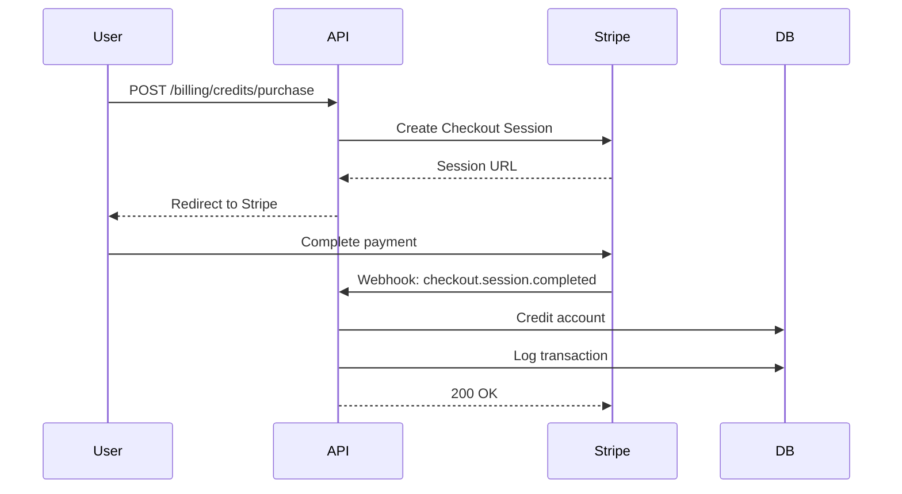

# Payment System

This document describes the payment system architecture for the Pull Layer, enabling monetization of agent queries through multiple payment methods.

## Overview

The payment system supports three payment methods:
- **Stripe** (fiat) - Credit/debit cards, subscriptions
- **[x402](https://www.x402.org)** (crypto) - HTTP-native cryptocurrency payments (v2 specification)
- **Credits** - Prepaid balance system

## x402 Protocol Reference

This implementation follows the **x402 v2 specification**.

**Official Documentation**: https://www.x402.org
**SDK**: [@x402/paywall](https://www.npmjs.com/package/@x402/paywall) (npm)
**Specification**: https://www.x402.org/writing/x402-v2-launch

### v2 Header Format

x402 v2 uses standard HTTP headers (replacing deprecated `X-*` prefix convention):
- `PAYMENT-REQUIRED` - Payment amount, currency, and recipient details
- `PAYMENT-SIGNATURE` - Signed payment proof from client
- `PAYMENT-RESPONSE` - Server confirmation after payment

### Supported Chains

- **Base** (primary - recommended for low fees)
- **Ethereum** (mainnet + Sepolia testnet)
- **Solana** (via x402 SDK)
- **Polygon** (PoS)
- **Other EVM L2s** (Arbitrum, Optimism, Linea)

### CAIP Compliance

x402 v2 aligns with [CAIP](https://github.com/ChainAgnostic/CAIPs) (Chain Agnostic Improvement Proposals) for cross-chain interoperability. Future versions will support `SIGN-IN-WITH-X` (CAIP-122) for wallet-controlled sessions.

## Authentication × Payment Matrix

Payment methods are available based on authentication layer:

| Auth Layer | Stripe | x402 | Credits | No Payment |
|------------|--------|------|---------|------------|
| **Layer 0** (Anonymous) | - | Tier 0-1 | - | - |
| **Layer 1** (API Key) | Tier 0-3 | Tier 0-3 | Tier 0-3 | Health only |
| **Layer 2** (Wallet) | Inherit | Inherit | Inherit | Agent profile |

### Layer 0: Anonymous (x402 Only)

Anonymous users can only pay via x402 micropayments:
- No account required
- Pay-per-query model
- Limited to Tier 0-1 queries
- Rate limited by IP (10 requests/hour)

```http
GET /api/v1/queries/getAgentProfile?agentId=42
PAYMENT-SIGNATURE: <payment_proof>
```

### Layer 1: API Key (All Methods)

Authenticated users with API keys can use all payment methods:
- Stripe for subscriptions and one-time payments
- x402 for crypto payments
- Credits for prepaid balance
- Full access to Tier 0-3 queries

```http
GET /api/v1/queries/getReputationReport?agentId=42
Authorization: Bearer sk_live_abc123...
X-Payment-Method: credits
```

### Layer 2: Wallet Signature (Inherit)

Agents authenticating via wallet signature inherit payment methods from their linked account:
- Uses linked organization's credits balance
- Can trigger Stripe charges if configured
- Supports x402 for crypto-native agents

```http
GET /api/v1/queries/getMyFeedbacks
X-Agent-Id: 42
X-Chain-Id: 84532
X-Signature: 0x...
```

See [Authentication Documentation](../auth/AUTHENTICATION.md) for complete auth layer details.

## Architecture

```
┌─────────────────────────────────────────────────────────────────┐
│                       Payment Methods                            │
│                                                                  │
│   ┌───────────┐    ┌───────────┐    ┌───────────┐              │
│   │  Stripe   │    │   x402    │    │  Credits  │              │
│   │  (Fiat)   │    │  (Crypto) │    │ (Prepaid) │              │
│   └─────┬─────┘    └─────┬─────┘    └─────┬─────┘              │
│         │                │                │                     │
│         └────────────────┼────────────────┘                     │
│                          │                                      │
│                   ┌──────▼──────┐                               │
│                   │  Payment    │                               │
│                   │  Gateway    │                               │
│                   └──────┬──────┘                               │
│                          │                                      │
│         ┌────────────────┼────────────────┐                     │
│         │                │                │                     │
│   ┌─────▼─────┐   ┌──────▼──────┐  ┌─────▼─────┐              │
│   │  Credits  │   │  Payment    │  │  Usage    │              │
│   │  Balance  │   │   Nonces    │  │   Logs    │              │
│   └───────────┘   └─────────────┘  └───────────┘              │
└─────────────────────────────────────────────────────────────────┘
```

## Credit Pricing

Query tools are organized into 4 tiers with different pricing:

| Tier | Base Price | Description | Examples |
|------|-----------|-------------|----------|
| 0 | 0.001 USDC | Raw queries (events, lookups) | `getMyFeedbacks`, `getValidationHistory`, `getAgentProfile` |
| 1 | 0.01 USDC | Aggregated (summaries, trends) | `getReputationSummary`, `getReputationTrend` |
| 2 | 0.05 USDC | Analysis (patterns, comparisons) | `getClientAnalysis`, `compareToBaseline` |
| 3 | 0.20 USDC | AI-powered (reports, insights) | `getReputationReport`, `analyzeDispute`, `getRootCauseAnalysis` |

### Price Multipliers

Final price = Base Price × Period × Scope × Freshness

**Period Multipliers**:
- 7 days: 1x
- 30 days: 1.5x
- 90 days: 2x
- 365 days: 4x

**Scope Multipliers**:
- Single agent: 1x
- Category: 2x
- All agents: 3x

**Freshness Multipliers**:
- Cached (>1h): 0.3x
- Recent (<1h): 1x
- Real-time: 1.5x

## Database Schema

### Organizations Table

```sql
CREATE TABLE organizations (
    id UUID PRIMARY KEY DEFAULT gen_random_uuid(),
    name TEXT NOT NULL,
    slug TEXT UNIQUE NOT NULL,
    owner_id UUID NOT NULL REFERENCES users(id),
    stripe_customer_id TEXT,
    created_at TIMESTAMPTZ DEFAULT NOW(),
    updated_at TIMESTAMPTZ DEFAULT NOW()
);
```

### Organization Members Table

```sql
CREATE TABLE organization_members (
    id UUID PRIMARY KEY DEFAULT gen_random_uuid(),
    organization_id UUID NOT NULL REFERENCES organizations(id) ON DELETE CASCADE,
    user_id UUID NOT NULL REFERENCES users(id) ON DELETE CASCADE,
    role TEXT NOT NULL CHECK (role IN ('admin', 'member', 'viewer')),
    invited_by UUID REFERENCES users(id),
    joined_at TIMESTAMPTZ DEFAULT NOW(),
    UNIQUE (organization_id, user_id)
);
```

### Credits Table

```sql
CREATE TABLE credits (
    id UUID PRIMARY KEY DEFAULT gen_random_uuid(),
    organization_id UUID NOT NULL REFERENCES organizations(id) ON DELETE CASCADE,
    balance DECIMAL(20, 8) NOT NULL DEFAULT 0,
    currency TEXT NOT NULL DEFAULT 'USDC',
    updated_at TIMESTAMPTZ DEFAULT NOW(),
    UNIQUE (organization_id, currency)
);
```

### Credit Transactions Table

```sql
CREATE TABLE credit_transactions (
    id UUID PRIMARY KEY DEFAULT gen_random_uuid(),
    organization_id UUID NOT NULL REFERENCES organizations(id),
    amount DECIMAL(20, 8) NOT NULL,
    type TEXT NOT NULL CHECK (type IN ('purchase', 'usage', 'refund', 'bonus')),
    description TEXT,
    reference_id TEXT,  -- Payment ID, query ID, etc.
    balance_after DECIMAL(20, 8) NOT NULL,
    created_at TIMESTAMPTZ DEFAULT NOW()
);

CREATE INDEX idx_credit_transactions_org ON credit_transactions(organization_id);
CREATE INDEX idx_credit_transactions_created ON credit_transactions(created_at DESC);
```

### Subscriptions Table

```sql
CREATE TABLE subscriptions (
    id UUID PRIMARY KEY DEFAULT gen_random_uuid(),
    organization_id UUID NOT NULL REFERENCES organizations(id) ON DELETE CASCADE,
    stripe_subscription_id TEXT NOT NULL,
    plan TEXT NOT NULL,  -- 'starter', 'pro', 'enterprise'
    status TEXT NOT NULL CHECK (status IN ('active', 'canceled', 'past_due', 'trialing')),
    current_period_start TIMESTAMPTZ NOT NULL,
    current_period_end TIMESTAMPTZ NOT NULL,
    created_at TIMESTAMPTZ DEFAULT NOW(),
    updated_at TIMESTAMPTZ DEFAULT NOW()
);
```

### Payment Nonces Table

```sql
CREATE TABLE payment_nonces (
    id UUID PRIMARY KEY DEFAULT gen_random_uuid(),
    organization_id UUID NOT NULL REFERENCES organizations(id),
    nonce TEXT UNIQUE NOT NULL,
    amount DECIMAL(20, 8) NOT NULL,
    currency TEXT NOT NULL,
    status TEXT NOT NULL CHECK (status IN ('pending', 'completed', 'expired', 'failed')),
    payment_method TEXT NOT NULL CHECK (payment_method IN ('stripe', 'x402', 'credits')),
    expires_at TIMESTAMPTZ NOT NULL,
    completed_at TIMESTAMPTZ,
    created_at TIMESTAMPTZ DEFAULT NOW()
);

CREATE INDEX idx_payment_nonces_nonce ON payment_nonces(nonce);
CREATE INDEX idx_payment_nonces_status ON payment_nonces(status) WHERE status = 'pending';
```

## API Endpoints

### Organizations

```
POST   /api/v1/organizations              # Create organization
GET    /api/v1/organizations              # List user's organizations
GET    /api/v1/organizations/:id          # Get organization details
PUT    /api/v1/organizations/:id          # Update organization
DELETE /api/v1/organizations/:id          # Delete organization
POST   /api/v1/organizations/:id/members  # Invite member
GET    /api/v1/organizations/:id/members  # List members
DELETE /api/v1/organizations/:id/members/:user_id  # Remove member
```

### Billing

```
GET    /api/v1/billing/credits            # Get credit balance
POST   /api/v1/billing/credits/purchase   # Purchase credits (Stripe)
GET    /api/v1/billing/transactions       # List transactions
GET    /api/v1/billing/usage              # Usage summary
POST   /api/v1/webhooks/stripe            # Stripe webhook handler
```

## Payment Flow

### Stripe Payment Flow

1. User requests credit purchase
2. Backend creates Stripe Checkout Session
3. User completes payment on Stripe
4. Stripe sends webhook (`checkout.session.completed`)
5. Backend credits user account
6. Backend logs transaction



### x402 Payment Flow (Week 18)

1. Agent sends query request
2. If payment required, server returns `HTTP 402` with `PAYMENT-REQUIRED` header
3. Agent constructs payment using `@x402/paywall` SDK
4. Agent retries request with `PAYMENT-SIGNATURE` header
5. Backend verifies payment on-chain
6. Process query and return result with `PAYMENT-RESPONSE` header

```http
# Initial Request (no payment)
POST /api/v1/a2a/rpc
Content-Type: application/json

# Response (payment required)
HTTP/1.1 402 Payment Required
PAYMENT-REQUIRED: {
  "amount": "0.05",
  "currency": "USDC",
  "recipient": "0x...",
  "chain": "base",
  "validUntil": 1734500000
}

# Retry with payment proof
POST /api/v1/a2a/rpc
Content-Type: application/json
PAYMENT-SIGNATURE: <signed_payment_proof>

# Success response
HTTP/1.1 200 OK
PAYMENT-RESPONSE: {"txHash": "0x...", "status": "confirmed"}
```

**SDK Integration** (using `@x402/paywall`):
```typescript
import { createPaywall } from '@x402/paywall';

const paywall = createPaywall({
  chain: 'base',
  currency: 'USDC',
});

// Automatically handles 402 responses and payment flow
const response = await paywall.fetch('/api/v1/a2a/rpc', {
  method: 'POST',
  body: JSON.stringify({ query: '...' }),
});
```

### Credit Deduction Flow

1. Query request received
2. Calculate query cost (tier × multipliers)
3. Check credit balance
4. If sufficient, deduct credits atomically
5. Process query
6. Log usage

```sql
-- Atomic credit deduction
BEGIN;
UPDATE credits
SET balance = balance - $1, updated_at = NOW()
WHERE organization_id = $2 AND balance >= $1;

-- If no rows updated, insufficient balance
IF NOT FOUND THEN
    ROLLBACK;
    RAISE EXCEPTION 'Insufficient credits';
END IF;

INSERT INTO credit_transactions (organization_id, amount, type, balance_after)
VALUES ($2, -$1, 'usage', (SELECT balance FROM credits WHERE organization_id = $2));
COMMIT;
```

## Subscription Plans

| Plan | Monthly Price | Credits Included | Features |
|------|--------------|------------------|----------|
| Starter | $0 | 100 | Tier 0-1 queries only |
| Pro | $49 | 2,000 | All tiers, priority support |
| Enterprise | Custom | Unlimited | Custom integrations, SLA |

## Implementation Timeline

### Week 11: Account Model + Organizations
- Create `organizations` and `organization_members` tables
- Implement organization CRUD endpoints
- Add role-based access middleware
- Link users to organizations

### Week 12: Credits System + Stripe
- Create `credits`, `credit_transactions`, `subscriptions` tables
- Implement credit balance endpoints
- Integrate Stripe SDK (`stripe-rust = "0.26"`)
- Set up Stripe webhooks

### Week 15: Payment Nonces
- Create `payment_nonces` table
- Implement idempotent payment processing
- Add nonce expiration handling

### Week 18: x402 Integration
- Implement x402 payment protocol
- Add on-chain payment verification
- Support Base, Ethereum, Polygon networks

## Security Considerations

1. **Stripe Webhooks**: Verify signature using `stripe.webhooks.constructEvent()`
2. **Credit Deductions**: Use database transactions for atomic operations
3. **Rate Limiting**: Limit credit purchase requests (10/hour per user)
4. **Audit Trail**: Log all payment events with timestamps
5. **PCI Compliance**: Never store card details (Stripe handles this)

## Monitoring

Key metrics to track:
- Credit purchase volume (daily/weekly/monthly)
- Credit usage by tier
- Payment success rate
- Average time to credit account
- Failed payment reasons

## Related Documentation

- [A2A Integration](../protocols/A2A_INTEGRATION.md)
- [Query Tools](../api/QUERY_TOOLS.md)
- [Database Schema](../database/schema.md)

---

**Last Updated**: November 24, 2024
